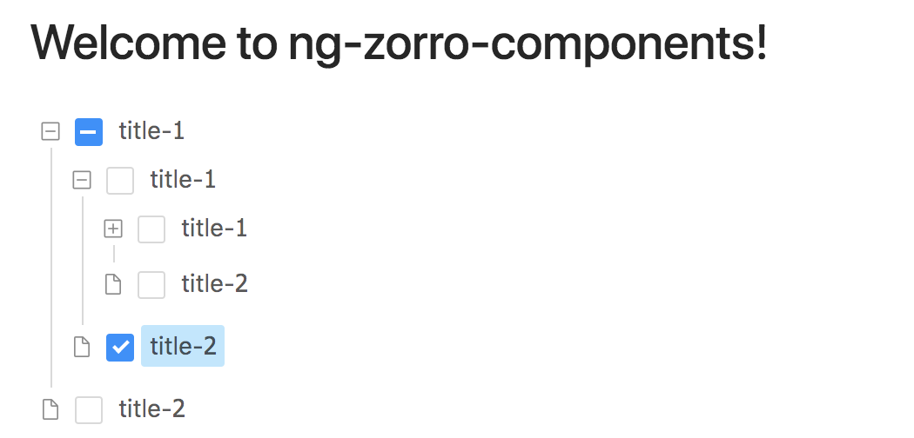

[Angular](https://github.com/angular/angular) 已升级至 6.0.0，而 [NG-ZORRO](https://github.com/NG-ZORRO/ng-zorro-antd) 0.7.0 还处于 beta 阶段，ng 6.0 的适配更要等到 1.0 版本了，所以本项目提供了一种可以兼容的方案。

运行该 Demo 项目

```
git clone https://github.com/jakechan2012/ng-zorro-upgrade-demo.git
cd ng-zorro-upgrade-demo
npm install
npm start
```

## NG-ZORRO 0.7.0 与 Angular 6.0.0 / Angular CLI 6.0.0 的冲突

本 Demo 采用 NG-ZORRO 版本是 0.7.0-beta.5，使用 Angular CLI 6.0.0 创建的项目

### 1. less 错误

Angular CLI 升级之后，默认没有启用 less 的 JavaScript，而 ZORRO 恰恰使用 JavaScript，导致 Angular CLI 无法编译 ZORRO，得到以下报错

```
Inline JavaScript is not enabled. Is it set in your options?
```

在 Angular CLI 未更新前，可以用一个曲线救国的方案，通过增加 `prestart` 脚本在启动开发服务器之前手动先行编译 less，并将 `angular.json` 中的 `styles.less` 更改为 `styles.css`即可

### 2. rxjs 错误

由于 Angular 6.0 依赖 rxjs 6.0，而 rxjs 6.0 拥有若干 breaking changes，不过其提供了 rxjs-compat 来解决兼容问题，升级 rxjs 后添加该包即可

### 3. 不同版本的 Angular

由于 ZORRO 目前还只支持 Angular 5.x 版本，当项目中存在多个 Angular 版本则会遇到以下报错

```
error TS2451: Cannot redeclare block-scoped variable 'ngDevMode'.
```

通过 [Angular #21925](https://github.com/angular/angular/issues/21925) [chuckjaz](https://github.com/chuckjaz) 的回复

> If you require to have a separate compilation then I recommend using something like ng-packgr to help build the module directory as a package. This package can then be installed into the node_modules of app.

可以得出结论，同一个项目中是不能存在多个版本的 Angular 的，如果你想要这么做，可以安装到 node_modules 中，也就是将另一个版本作为一个 package 安装到你的项目中来。

本项目就是创建了一个自己的组件库 @myscope/components，然后安装到了主项目中

## 最后

我认为将第三方组件包裹在你的私人库中，是一个很好的解决方案，即便没有这个冲突也应该这么做。

通过了自己的封装，我们将第三方组件引入到了我们的项目中，即使第三方组件将来存在 breaking changes，也不会影响我们封装的组件对外提供 API（事实上 NG-ZORRO 0.7.x 已经存在 breaking changes 了）。

同时也便于组件开发者对整个组件库的控制，对项目的升级会比较友好。
